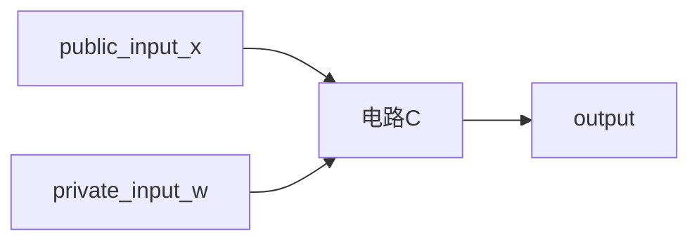

本文为学习snark的总结。主要是被各种博客搞混了，需要梳理。

目前关于zk-snark的博客有很多，但是很多博客看完之后都或多或少存在一些疑问。比如有的博客侧重于通过讲故事的方式来说明，但是却只能举一些简单例子，同时篇幅长让人找不准方向；有的博客是直接从多项式的方法进行数学推导，逐步按照问题-解决的方式，但会让人不明白到底是要解法到底与遇到的问题有什么关系，总不可能是$f(x) = x^3 + x + 1$ 这种简单的问题吧。由于zk-snarks内容较为庞大，每一篇博客都有不同的切入视角，也因此造成了不同的理解问题。

个人目前的理解是，1）是什么问题引入了这个技术，2）是什么原则让这一类问题逐步转变为了多项式模型，3）多项式模型的解法，4）整个技术过程的大背景

**问题来源**

主要来源于两个应用：隐私交易和zk-rollup。隐私交易要求在不揭露具体交易信息的前提下，向外部证明其交易的合法性；zk-rollup要求在不提交layer2层交易的签名等校验数据的前提下，向layer1证明交易的合法性。

**问题抽象**

这类问题可以按照定义上，抽象为以下陈述：

>prover能够向verifier提交proof，证明prover能够知道某种private knowledge/witness，来解决某一个问题。但不需要提供 private witness

这里难点还是在于理解，问题是什么？

最主要的一步，是把 语言描述的 『问题』抽象为 『NP问题』

对于verifier来说，如果这个问题是P问题，那么其不需要private witness，就可以在多项式时间内求解。只有是NP问题，由于缺少了 private witness，只能够验证其解。

而 prover拥有private witness，因此其可以在多项式时间内找到一个解。这个解可以作为 proof 传递给 verifier，让其验证。

由于NP问题内部可以相互归约，所以zk-snark在初始阶段会有这些转换的过程

```
problem => program code => circuit satisfiction => QAP
all np-hard can be convert into arithmetic circuits
```

转换到了QAP之后，就是多项式整除问题的数学推理了。

**非交互**

从验证的角度来说，由于没有第三方，此时只能是按照随机概率的形式来论证，而非证明。

> 在没有可信第三方的前提下，无法实现买卖两方的交易。

schnorr协议提供了一种能够verifier利用随机值来检验prover，并随着检验次数增加，可信概率增加。

但是如果要转变为非交互的形式，那么同样是需要借助与随机值。唯一不同的是，把verifier生成随机值的过程，转变为其他方式：随机预言机或者公共字符串。可以理解为，按照公共可信多方计算的方式生成了一个随机数，并且通过密码学方法 要求 prover 必须使用这个随机数

**安全零知识**

要求prover有且仅有使用这个随机数，同时也不能够暴露其他信息。

需要同态加密的方法，避免暴露随机数的值给prover。

使用 pairing的配对方法 ，加上随机系数 KEA方法，保证proof一定是根据这个随机值计算得到。

使用$\delta 偏移$ 来隐藏prover的其他信息。让proof只能被verifier用来验证，而无法从中提取其他信息。

## 定义

zk-snark = 

zero knowledge: 零知识

succint 简洁的

non-interactive 非交互的

argument of knowledge：知识论证。证明proof是严谨的，而论证argument是基于概率的，因此是论证。在proof system里，即使是计算能力无限的prover也无法欺骗 verifier去相信某一个错误的statement（统计上），在 argument system里面，只有多项式时间计算能力的没办法欺骗（计算可靠性）


词汇：

prover：提供证明的角色

verifier：验证这个证明的角色

问题：prover能够向vertify提交proof，证明prover能够知道某种private knowledge/witness，来解决某一个问题。但不需要提供 private knowledge。

```
private input
public input => function && constraint => output
```


### 应用：隐私交易

来源：安比实验室 《浅谈零知识证明：背景与起源》

问题来源：比特币的交易记录是全网公开的，交易的用户在提现时候，能够被查到对应的ID，同时该ID的所有交易情况均能够被查询。就好像是一个网名，被找到手机号后，也就找到了对应的实名。

比特币其实是一种假名机制。匿名（anonymous）与假名（pseudonymous）

增加隐秘性的方法：1）把多笔交易给打包，但是可以按照额度来区分；2）隐藏交易的额度。

pederson commitment：采用同态加密的方式，隐藏了数据本身，证明数字间的关系：$E(a)+ E(b) = E(a+b)$

但是此时无法约束数字的范围：[0, 2^256) && 保证转出的数据不超过额度。

> 问题：证明数字间的关系，$0 < a < 2^{256}$ 等陈述

应用：1) 第三方机构存储了大量数据，需要审计该数据库，确保每一个数据都没有问题。但是不愿意暴露每天业务流水等商业机密；2）数据所有权转移


### 应用：rollup过程

也就是数据的计算/存储

来源：《rollup原理zk/op》-- ethan if(DAO) mirror.xyz

layer2扩容工作的主要目的是提高以太坊的TPS，每秒事务处理量。这里的以太坊事务可以简单理解为交易。由于每一笔交易都伴随大量的共识计算，所以限制了目前EVM的TPS，一个处理思路是把多笔交易在链下计算好并打包(rollup)压缩到一起，再统一提交到主链上。

**以太坊的状态**

注：按照简单理解

以太坊状态是整个以太坊全量账本的状态，通常用一个所有以太坊账户构成的merkle tree的root来表示。

每一个叶子都是一个{账户，余额，.....}的数据块。

以太坊的历史是当前区块包含的所有交易构成的交易树。

**layer2需要处理的工作**

1. 确保transaction的合法性：from账户是否有足够金额+gas fee，其nonce是否正确，签名是否正确。
2. relayer执行这一笔交易后，重新计算的merkle tree root的值。
3. 多笔交易后，把最终的merkle tree root放回到链上合约。

问题：如果layer1要验证layer2的提交，需要的是把所有的transaction提交过来，计算merkle tree，但是这样就相当于重新在layer1上计算。

**zk-snark的作用**

把以太坊的状态函数的(输入，计算过程，输出) 构建为多项式，将多项式生成proof，验证者通过proof验证这次提交。

**基本原理**

layer2项目的两个角色：

transactor（外部用户）

relayer（中继者）：收集并验证交易，把交易打包压缩，生成zk-snark的proof。提交（交易的核心数据、proof、新的merkle tree root）到 layer1上的对应智能合约，智能合约验证proof，将新的merkle tree root提交到新的区块。

关于压缩：提交的交易的核心数据相比 与 relayer收集到的交易，不包括nonce和signature。

注：也就是nonce，signature这些都属于不用提交的 witness。

## 感性认识

用最快的方式说明：

> prover能够向verifier提交proof，论证prover能够知道某种private knowledge/witness，来解决某一个问题，不需要提供 witness

1. 概率上验证
2. 非交互式
3. 随机数

**大致思路**

1. schnorr协议作为一种交互性协议，只要prover事先无法预知verifier的随机数，就能够实现验证。
2. 如果不交互，那随机数可以通过安全的hash函数来生成，被成为 随机预言机模型，这个过程被称为fiat-shamir transform过程，用随机预言机解决随机问题，避免了可信的setup问题。
3. zk-snarks 采用可信setup过程

```
computation
algebraic cuicuit
r1cs
QAP
linear PCP
linear interactive proof
zk-snark
```


#### schnorr协议：

该协议通过交互的方式实现了随机的验证。

假设：prover拥有私钥sk，公钥pk = sk * G，G是椭圆曲线的生成元

问题：prover向verifier证明自己拥有私钥。

1. prover选取一个随机数k，计算 K = k * G，把K发送给verifier
2. verifier选取随机数 c，发送给prover
3. prover计算 r = k + c * sk，把r发送给verifier
4. verifier验证 rG ?= K + c * pk

根据 “椭圆曲线离散对数难题”，无法通过 pk 和 G 是无法推导出 sk。

prover事前不知道c，因此无法伪造 r。

#### 是什么问题

参考 《深入浅出零知识证明之zk-snarks》by xschuan 香橙


P问题是多项式时间内可解的问题，NP问题是属于多项式时间内不可解，但是可以快速验证某一个解。

zk-snark是针对NP问题的，如果是P问题，直接去求解即可，不用说要verifier去验证了。

目前最多的NP问题是QAP问题。


#### 构造snark

来源：《浅谈零知识证明之二：简短无交互证明》 -- 安比实验室

**把问题用数学运算电路表达**

问题（可编程的函数） => 逻辑电路 => 数学运算电路

数学运算电路的基础模块为“加法门”和“乘法门”。

如果限制input为1/0的时候，非常方便，所以难点在于如何约束 *运算电路的输入*

构造一个 $n*(n-1) = 0$作为约束电路。

**可证明的数学运算电路**



目标：证明电路 C(x, w) = 0。也就是说，prover 和 verifier已知 C && x的情况下，prover需要证明它知道x，满足$C(x, w) = 0$

**非交互简短证明**

包括三个核心算法：setUp、prove 、Verify

已知电路C：

setUp：进行预处理， $setUp(C) -> (proveKey, verifyKey)$ 算法复杂度为$O(|C|)$

prove：$prove(proveKey, x, w) -> pi$ ， 最终的证明pi的空间复杂度是$O(log(|C|))$

verify：$verify(verifyKey, x, pi) -> 0/1$，算法复杂度为$O(x + log(|C|))$

#### 构造电路案例

接上文

来源：《浅谈零知识证明之二：简短无交互证明》 -- 安比实验室

**私密交易的输入输出的取值空间**

问题：证明当前区间 $0 < w < 2^{256}$

已知如果要约束取值为0/1的时候，采用$n(n-1) = 0$作为约束电路

方案：把w按照二进制拆分，约束每一位的范围

**私密交易的所有权**

问题：证明交易发起者的账户余额满足支付需求

换个说法，证明 A的余额大于5 满足当前世界状态。

1）按照merkle tree思路，一路计算hash值，直到root，然后对比。但是这种方法则会暴露A的余额具体值。

2 ) 构造电路 $Hash(w) - x = 0$  

(似乎不重要？) 大致是用来感受理解电路是个什么东西

### snark体系的实现

来源：《浅谈零知识证明之三：zkSNARK证明体系的实现（上）》

包括三个核心算法：setUp、prove 、Verify

已知电路C：

setUp：进行预处理， $setUp(C) -> (proveKey, verifyKey)$ 算法复杂度为$O(|C|)$

prove：$prove(proveKey, x, w) -> pi$ ， 最终的证明pi的空间复杂度是$O(log(|C|))$

verify：$verify(verifyKey, x, pi) -> 0/1$，算法复杂度为$O(x + log(|C|))$

#### 历史

PCP定理被证明 probabilistically checkable proof ：所有的NP问题都可以在多项式时间内通过概率验证的方式被证明。

*概率验证* 可以理解为随机抽查。

**所有NP问题都可以有效转换为数学运算电路**  ( all np-hard can be convert into arithmetic circuits) 大概就是一个编译器之类的吧 from a code program into a circuit。

many of zksnarks are based on circuit satisfiability problem, which is a np-hard problem. so after converting a np problem into a circuit. 

---- in stackexchange.com : how to construct a circuit in zksnark。


// 感觉关键还是在于问题是什么.....

由此可以构造一个PCP的验证系统


从pcp到kilian SNARK ：用merkle来保证 proof没有被修改。把proof的大小从$O(C) -> O(logC)$


从交互式 => 非交互式

fiat-shamir heuristic 算法：把任何交互式随机验证协议转换。（随机预言机）

> “哈希函数是随机预言机” 是一个非常强的假设，目前没有被彻底证实。因此是启发式的heuristic


从PCP到LPCP（linear）

PCP：任何NP-问题都可以通过简短的随机抽验来验证。

LPCP：任何 d阶多项式P，可以通过随机验证多项式的几个点来验证多项式的系数。（比如要验证一个数组，可以把数组作为系数向量来构造一个多项式，这样验证的概率就大多了）


#### 从电路到R1CS

rank-1 constraint system：三个矩阵 $A,B,C \in R^{m\times (n+1)}$，存在一组解 $z$ ，满足 $(A\cdot z) \circ (B\cdot z) = C\cdot z$ 。其中$\circ$ 是逐项积，$C_{ij} = A_{ij} * B_{ij}$

把电路的每一个*逻辑门*的关系用构造的矩阵$A,B,C$来表示，然后把 $z = [x, w, 1]^T$表达，构造$A,B,C$，满足$Circuit(x,w) = 0$

后面是“区间证明”的案例......基本可以用 $F_i(w, x) = 0$ 来把电路给表达出来 -- 

#### 从R1CS到多项式(QAP)

目标：把$(A\cdot z) \circ (B\cdot z) = C\cdot z$ 用多项式来表达。

通过插值的方式 $f(i) = (A\cdot z)_i$，求解对应的系数向量。

得到 $A,B,C$ 对应的多项式 $P,Q,R$，能够满足 $P(x) \times Q(x) = R(x)$. 然后就可以验证输入的私密输入w是否满足验证要求。

最终多项式的表达形式：

$[1, x, x^2, ... ,x^d][f_0, f_1,..., f_d]^T = f(x)$

实际工程中，需要用到FFT来快速找到表达约束关系的多项式。


若不知道向量z，需要指数时间暴力搜索。

QAP多项式的整除关系是一个NP问题。所以说，任意NP问题 => 电路问题=>QAP问题，都是属于NP归约。

在电路写程序方面已经非常成熟，尤其是嵌入式。不过硬件中都是逻辑电路。

多项式时间运算关系的代码，都可以用算术电路表示。


万字入门教程：由浅入深理解零知识证明ZKP marsbit 

#### 从多项式到LPCP

把三个多项式在r上的取值，转换为 $<q_i, z>$的内积。把随机取值问题转换为寻找三个query向量$q_1, q_2,q_3$。

**LPCP验证**

1. prover计算好证明 $\pi = [w, h(m+1), ..., h(2m-1)]$
2. verifier随机选一个r，计算对应的向量 $q_1, q_2, q_3$。
3. 由于是$q \cdot z$ ，而$z = [1, x, w]$，x是公共知道的，所以只需要计算w部分即可，$q = [q_l, q_r]^T$, verifier只需要发送$q_r$即可，
4. prover把每一个q和自己的证明相乘，得到$a,b,c | a = <q_1, \pi>$，发回verifier验证。


#### trusted setup

随机预言机模型不足：1）证明大小与电路成正比，不简短；2）不满足零知识。

公共参考字符串(crs)：在证明开始时，有一个随机生成的字符串。

**新增步骤**

第三方根据LPCP用到的R1CS电路，选取随机数r，生成query，并放到CRS中。

然后再开始prover的步骤。

但是此时query暴露在CRS中，无法避免prover作弊。需要query不能被知道但是可以用来计算内积。

**线形加密系统 linear-only encoding**

加密需求：

1. 看到[q]密文的prover无法知道原文q；
2. prover能够生成内积 [qi]的数值可以与证明$\pi$进行线性组合计算，满足加法同态；
3. verifier能够验证[a]*[b] = [c]，满足乘法同态。
4. 且prover必须是要使用这个[qi]

满足以上需求的加密系统：pairing配对属性的循环群。（这个具体操作似乎在最早vscode中有讲，怎么配对）

**随机线性检查**

要防止prover在计算中途替换证明$\pi$，所以在生成query的时候，还随机选择$\alpha,\beta,\gamma$，得到一个线性约束 $q^* = \alpha *q_1 + \beta * q_2 + \gamma * q_3$，并带入到发送的信息中。（相当于是两个验证，先验证有没有替换作弊，然后随机验证正确性）。

**零知识**

确保$a,b,c$不泄漏任何关于$w$的信息。还是需要加入随机系数。

**可信**setup

在生成了这些随机数后，一定要彻底摧毁使用的参数。

#### 小结

加密交易的需求来自于比特币交易是假名，而非匿名。需要隐藏交易额度。

把问题（区间证明、merkle证明）转换为数字算术电路。

数字算术电路 => R1CS => 多项式取值验证的形式

PCP => LPCP && 多项式取值问题转为LPCP问题

去掉交互的部分：fiat-shamir协议

使用CRS模型优化

为了防止prover作弊，使用线形加密系统

加入随机线性检查，防止prover作弊

增加随机多项式取值方法，实现零知识特性。


## 拓展背景

来源：《初识零知识和证明》--安比实验室 系列 + 《浅谈零知识证明：背景与起源》--安比实验室 + 《零知识证明 learn by coding libsnark 入门篇》 ---> 甚至可以还有rust版本的代码 + 《从零开始学zksnark》

这几篇系列文章感觉是最为全面的理论性介绍，包括从背景知识、案例、理论推导等。后面原理里面的文章比较注重了理论推理。

注意到每一系列的词汇都有所区别，所以需要对照这看。（知识、洞见）

另外推理过程中，有非常多的大前提，需要其他文章进行备注。


### 背景

#### 0. ZK-Pod 

已经有证明：

>在没有可信第三方的前提下，无法实现买卖两方的交易。

只是这个第三方是存在信任成本、隐私泄漏、个人信息滥用的问题。

> 比特币以去中心化的方式 “模拟” 出一个 “虚拟” 的 “可信第三方”

[个人] 共识机制就是在后台执行，平时不需要注意，但又无时不刻。

**zkcp的比特币-数据交易**


**怎么产生信任**

> 一般来说，协议的设计时的问题：A想让B相信某件事。如果此时有一个天使（B信任的人）能够让B确信A说的话，则这个协议是安全的。因此，零知识证明提供的信任能够替代一个可信第三方
>
> ----GMR89 论文中
>
> 零知识证明实现了一些密码学理论技术，基于一些安全假设 “模拟” 出了一个虚拟的可信第三方


区块链解决的是 “分布式计算的信任”，零知识证明解决的是 “数据的信任”，形式化验证解决的是 “逻辑的信任”。


#### 1. 浅谈零知识证明：背景与起源

**证明的发展**

> 古希腊：“证明” == “洞见”

基于公理和逻辑，希腊人用证明说服对方，而不是靠权威。这是一种“去中心化”的方法论。

一个证明中，往往包含了某种深刻的“洞见”。

> 二十世纪初：“证明” == “符号推理”

从康托、罗素、歌德尔开始，出现形式化逻辑的符号系统，“证明”是用符号语言编写的一种推理过程。（参看《逻辑的引擎》）。

但是歌德尔不完备定理+图灵机停机问题的不可判定性，证明一个系统不可能找到全部真理。似乎是说明，证明不仅仅是严格的推理，还需要某种难以机械化的创造性思维。“证明”中包含了“知识”，突破后能够提升我们的认知。不论“洞见”还是“推理过程中的算法”，一个定理的证明的内涵 远远超出其定理本身。

> 六十年代：“证明” == “程序”

发现了“逻辑系统” 和 “计算系统--lambda演算” 的对应关系，curry-howard correspondence.

也就是说，“编写程序” 与 “编写证明” 在概念上是统一的。（《软件基础 software foundation》）

证明意味着构造算法，算法就是写代码。可以把一些机械化的工作交给机器。

此时，“寻找证明”非常具有挑战性，而“验证证明”则属于比较机械的工作。

> 八十年代：“证明” == “交互”

《交互式证明系统中的知识复杂性》，提出了交互式证明系统的概念：通过构造两个图灵机进行“交互”而不是“推理”，证明一个命题在概率上是否成立。

“证明”包含“知识”，但是“验证过程”不泄漏“知识”。【其实这样说反而难懂.....】

**交互式证明 && 有什么用处**

这两节都是写一些案例。

【zkPoD: 区跨链，零知识证明与形式化验证】

零知识证明是模拟出第三方，来保证某一个论断是可信的。

这个X断言，可以是一个NP复杂度的算法。可以通过程序在多项式时间内验证某一个值是否满足这个X断言。

**地图三染色问题**

总结：利用概率性地多次交互验证。

[知识] 就是后面说的 witness 吧，也就是 private info

**可验证计算 && 电路可满足性问题 **

A 有一个程序交给B，让B来计算，B得出结果p，A如何verify这个p结果对不对呢？

verify过程：

把程序（没有死循环）转换为 算术电路。

电路的每一个门的输入输出都记录下来，看满足加法/乘法否。

弊端：1. 复杂度可能很大；2. verifier看到了所有的电路运算细节

如果这个问题是"计算A的银行密码长度"，代码是计算一个字符串长度，那B在verify过程中，就知道密码。

因此，引出了零知识证明的概念。

#### 2. 从模拟来理解

其实就是说，要说明这个过程是零知识的，就应该在思想实验上，找到一个理想世界的超能力。prover只有拥有超能力时候才能知道 知识，而不能在现实世界知道知识。这样反过来证明 "零知识" 成立。


### 版本

**多项式**

>多项式的[知识]就是多项式的系数

schwatz-Zippel定理：没有共享连续段的两个不同的曲线。

如果要prover声明其拥有某多项式p的知识，那么就随机取一个点x，让其计算p(x)，看对不对。

最简单的版本。

```
0. prover 陈述其指导 f=p(x) 的知识(系数)
1. verifier 知道f = p(x)表达式，并随机选择一个x，并本地计算其结果 p(x)
2. verifier 传递 x 给 prover
3. prover 带入x计算，得到结果y
4. verifier 验证 y == p(x), 如果是，则说明 prover陈述有较大可信度
```

拆出商h(x)，保持zk

```
1. verifier 随机选择 s，计算 t = t(s)，然后把s发送给prover
2. prover 计算 h(x) = p(x) / t(x), 并且计算 h = h(s), p = p(s)
3. verifier 验证 h * t == p
```

防止`prover`根据`t(x)`表达式作弊，也就是随意构造一个`(p, h)`对。

同态加密防止`prover`作弊，隐藏`s`的值。

​	verifier:

 * 随机选择`s`，假设`p(x)`的维度是`d`，计算 $ g^{s^i} = E(s^i),  i=0, 1, ..., d$

 * 计算$t = t(s)$，并且把$(g^{s^i}, i=0,1,...,d)$ 给prover

​	prover:

	* 计算$h(x) = p(x) / t(x)$, 利用系数，直接计算出 $h = \sum_{}Ci * g^i$和 $p=\sum{}C^i * g^i$
	* 验证


## 实践

### 01 创建电路

如何使用circom和snarkjs创建一个零知识电路，并且创建证明，在以太坊上vertify。

1. 已经把问题转换为电路

创建circuit.circom文件，证明能够因式分解。对于电路来说，就是`private input` 加上 `public input`

然后输出`output` 也就是`proof`，此时`vertifier`不知道`private input`。


````bash
# 安装 zksnark-test
mkdir zksnark-test
cd zksnark-test
npm install -g circom
npm install -g snarkjs
# 编写电路，能够证明能够因式分解整数 
```
template Multiplier() {
	signal private input a;
	signal private input b;
	signal output c;
	c <== a*b;
}
component main = Multiplier();
```
# 编译电路
circom circuit.circom --r1cs --wasm --sym
# 生成三个文件
# circuit.r1cs 	r1cs电路的二进制格式
# circuit.wasm	用来生成witness
# circuit.sym	打印与调试

# 查看电路信息
snarkjs info -r circuit.r1cs
snarkjs r1cs circuit.r1cs circuit.sym

# snarkjs进行可信配置 或者 -r <circuitFIle.r1cs>
snarkjs plonk setup circuit.r1cs pot12_final.ptau circuit_final.zkey

# 计算witness：
# circuit.wasm + input.json => witness.json
# input.json内容：# 随机选择
{"a": 3, "b": 11}

snarkjs calculatewitness --wasm circuit.wasm --input input.json
# witness.json: # 这个虚拟的1其实就是向量的齐次化
[
	"1",
	"33", # output
	"3",
	"11"
]

# 创建证明
# witness.json + proving_key.json => proof.json + public.json(public && output)
snarkjs proof --witness witness.json --provingkey proving_key.json

# 验证 vertify：public.json + proof.json
# 也就是向 vertifier 证明  33 => (3, 11)
snarkjs verify --verificationkey verification_key.json --proof proof.json --public public.json

# 链上发布
# 生成一个能够验证零知识证明的智能合约
snarkjs generateverifier --verificationkey verification_key.json --verifier verifier.sol
# 把verifier.sol发布到remix

# 生成调用的参数：
snarkjs generatecall --proof proof.json --public public.json

# 将输出复制到remix的verifyproof方法的param字段，点击call
````

可信配置的目的是：“ prover的隐私 ”和“ 确保不欺骗vertifier ”之间的一种平衡。因此，引入了随机性，这种随机性包含在 vertifier 发送给 prover的质询（challenge）中（其实就是vertifier随机取了一个点，具体的数学表达就非常复杂了）

plonk：

witness是用来生成proof，同时其对vertifier不可见。是所有与电路约束所匹配的电路信号。（就是那些不愿意透露的与解决该问题有关的信息，可以理解为多项式的系数向量吧）

最后就是提交 proof.json 和 public.json 给验证者，这里是没有任何加密的，所以是一个非常简单的模型。

没有涉及到实际的跨链的各个数据的要求。

### 02 libsnark

参考：https://secbit.io/blog/2020/01/03/zkp-learn-by-coding-libsnark-101/

```bash
git clone https://github.com/sec-bit/libsnark_abc.git

cd libsnark_abc
git submodule update --init --recursive

# for ubuntu 20.04
sudo apt install build-essential cmake git libgmp3-dev libprocps-dev python3-markdown libboost-program-options-dev libssl-dev python3 pkg-config

mkdir build && cd build && cmake ..
make

./src/main
```

代码解读

```c++
// src/main.cpp 来自 Howard Wu 的 libsnark_tutorial
/*
r1cs_gg_ppzksnark 是 groth16 方案
直接使用自带例子
*/

r1cs_gg_ppzksnark_keypair<ppT> keypair = r1cs_gg_ppzksnark_generator<ppT>(example.constraint_system);

r1cs_gg_ppzksnark_processed_verification_key<ppT> pvk = r1cs_gg_ppzksnark_verifier_process_vk<ppT>(keypair.vk);

r1cs_gg_ppzksnark_proof<ppT> proof = r1cs_gg_ppzksnark_prover<ppT>(keypair.pk, example.primary_input, example.auxiliary_input);

const bool ans = r1cs_gg_ppzksnark_verifier_strong_IC<ppT>(keypair.vk, example.primary_input, proof);

const bool ans2 = r1cs_gg_ppzksnark_online_verifier_strong_IC<ppT>(pvk, example.primary_input, proof);

assert(ans == ans2);
```

更直观

```c++
// test.cpp Christian Lundkvist  libsnark-tutorial

// 初始化

// 以 x^3 + x + 5 = out 为例
protoboard<FieldT> pb; // 电路的面包板
pb_variable<FieldT> xx; // 每一个电路上的节点

// public input / private witness => primary / auxiliary variable
xx.allocate(pb, "xx"); // 把每一个节点放到面包板上
pb.set_input_size(1); // primary size is 1 所以与pb连接的前n个变量是public

// 连接面包板上的电路 / 约束条件
pb.add_r1cs_constraint(r1cs_constraint<FieldT>(x, x, sym_1)); // x*x = sym_1

// 后续工作与main.cpp一致
```

使用电路组件：gadgetlib

```c++
// range.cpp
// 要求在不泄露数字的情况下，证明该数字小于60

x.allocate(pb, "x");
max.allocate(pb, "max");
pb.val(max) = 60; // 设置最大值

comparision_gadget<FieldT> cmp(pb, 10, x, max, less, less_or_eq, "cmp");
cmp.genarate_r1cs_constraints();
/* 限制less变量的结果是true，less*1 == 1 */
pb.add_r1cs_constraint(r1cs_constraint<FieldT>(less, 1, FieldT::one()));

// 输入 witness
pb.val(x) = 18; // witness private
cmp.generate_r1cs_witness();
```


## 后记

### snark和stark

stark是交互型系统，也就避免了trusted setup过程，一般来说，目前stark都是及其复杂，但是在安全性上更优。在以太坊提供了zk-snark的预编译，相比而言，stark的成本更高。

## 参考

Dapp-learning-dao：basic/22-zk-snarkjs（实践）、crypto/zk-snark（理论）

登链社区：circom与snarkjs经典教程（实践）、简述零知识证明与zksnark by 元家昕（理解）、零知识证明-zksnark入门 by star li

https://news.marsbit.co/20220915070250253889.html 概括

V神post：zk-snarks under the hood 系列

安比实验室全部系列文章：

https://zhuanlan.zhihu.com/p/100809637 libsnark实践

https://zhuanlan.zhihu.com/p/99260386 翻译 从零开始学习zk-snark

github secbit：尤其是东泽和郭宇的两个系列讲述作为问题背景的入门。

数学推导：https://www.yuque.com/u428635/scg32w/edmn74 

其他：

explain snarks in electriccoin.co

zksnarks in a nutshell 

零知识证明之zk-snark --- ethan if(DAO) 

万字入门教程：由浅入深理解零知识证明 zkp  zero-knowledge proof: from zero to hero

